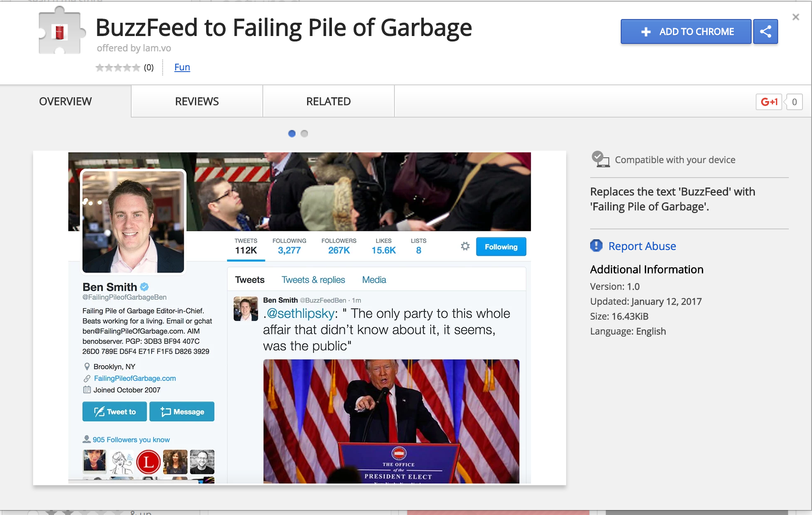

A chrome extension that replaces the text "BuzzFeed" with "Failing Pile of Garbage"

Also available on BuzzFeed: a sorting quiz that will tell you what [famous pile of garbage](https://www.buzzfeed.com/hannahjewell/what-famous-pile-of-garbage-are-you) you happen to be and [bumper stickers](https://shop.buzzfeed.com/collections/everything/products/copy-of-work-at-bumper-sticker?variant=35971001290) if you, too, get your news from "a failing pile of garbage." 

Proceeds from Failing Pile merch are donated to [Committee to Protect Journalists](https://cpj.org/). The code for this extension was modified from [@danksinker](https://twitter.com/dansinker)'s Tiny Hands extension (https://github.com/sinker/tinyhands)

## Installation Instructions

Please go to the [link](https://chrome.google.com/webstore/detail/buzzfeed-to-failing-pile/ofhgonkfnghihlemjaflfjdcohlhcohf?hl=en-US&gl=US) to the extension in the Chrome app store. Click "Add to Chrome" button to use the extension. 

To publish your own Chrome extension follow [these](https://developer.chrome.com/webstore/publish) steps. 
